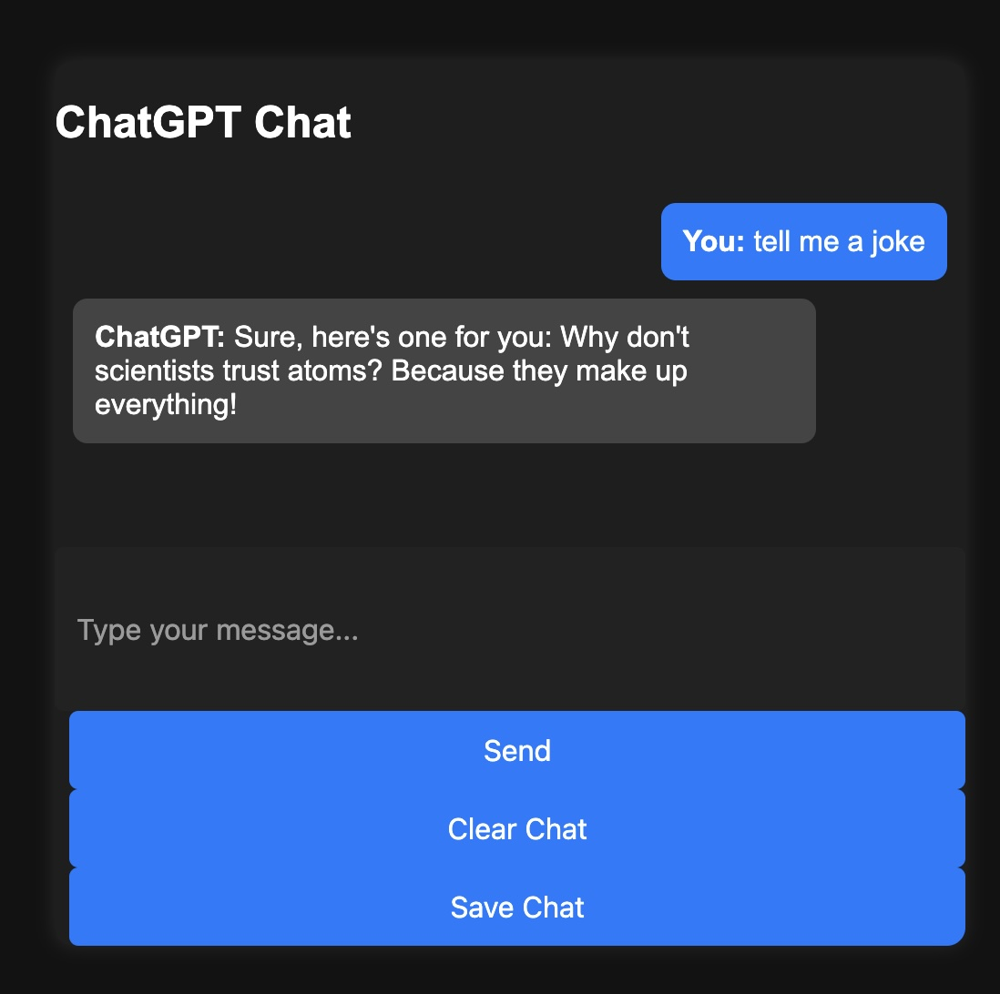

# AI Chat UI for OpenAI (Flask + Redis + Docker)

This project provides a simple and modern web interface for interacting with OpenAI's GPT models using Flask, JavaScript, Redis, and Docker. It includes chat history tracking, dark mode, typing indicators, and chat saving.

## 🚀 Features

- **Interactive Chat UI** – Clean, responsive web interface for chatting with OpenAI's GPT models.
- **Chat History Storage** – Session-based memory that persists browser refreshes and closures so the assistant remembers past messages.
- **Typing Indicator** – Shows when the assistant is "thinking."
- **Dark Mode UI** – Modern, mobile-friendly, and easy on the eyes.
- **Chat Saving** – Save chat logs as timestamped text files.
- **Dockerized Deployment** – Quickly deploy with `docker compose up -d --build`.
- **Redis Integration** – Chat history is now stored in Redis instead of Flask sessions.
- **Safe JSON Storage** – Replaced eval() with json.loads() for secure Redis data retrieval.

---

---

## 📦 Installation & Setup

### 1️⃣  Clone the Repository
```sh
git clone https://github.com/nick31415926/flask-chatgpt
cd flask-chatgpt
```

### 2️⃣ Set Up OpenAI API Key and Localhost IP
Instead of using a `.env` file, set the OpenAI API key as an environment variable in your OS:
```sh
export OPENAI_API_KEY=your-api-key-here  # For Linux/macOS
set OPENAI_API_KEY=your-api-key-here     # For Windows (Command Prompt)
$env:OPENAI_API_KEY="your-api-key-here" # For Windows (PowerShell)

export LOCALHOST_IP=your-ip-here  # For Linux/macOS
set LOCALHOST_IP=your-ip-here    # For Windows (Command Prompt)
$env:LOCALHOST_IP="your-ip-here" # For Windows (PowerShell)

```
Alternatively, you can manually copy and paste the API key inside the `docker-compose.yml` file.

---
## 🐳 Running with Docker

The app is Dockerized, so you can run everything in containers.

### 1️⃣ Build & Run with Docker Compose
```sh
docker compose up -d --build
```

### 2️⃣ Stop the Application
```sh
docker compose down
```

### 3️⃣ Clean Up Old Docker Images
```sh
docker system prune -af
```

---

## 🔥 Usage

Once the server is running, open your browser and go to:

📌 **http://127.0.0.1:5000/** *(or `localhost:5000`)*

### Basic Commands
- **Chat** – Type a message and press Send.
- **Clear Chat** – Click "Clear Chat" to reset history.
- **Save Chat** – Click "Save Chat" to download a log file.

---


## 🖥️ API Endpoints

| Method  | Endpoint         | Description                               |
|---------|-----------------|-------------------------------------------|
| POST    | `/chat`         | Sends message to GPT and gets a response |
| POST    | `/clear_history`| Clears chat history                       |
| OPTIONS | `/chat`         | Handles CORS preflight requests          |

---

## 🎨 Frontend Enhancements

- **Dark Mode UI**
- **Mobile-Optimized**
- **Chat Bubbles for User/AI Messages**
- **Typing Animation**
- **Save Chat Logs**

---
## 🔧 Backend Improvements

- **Redis Integration** – Chat history is now stored in Redis instead of Flask sessions.
- **Single Redis Connection** – Optimized performance with a shared Redis instance.
- **Safe JSON Storage** – Prevents errors by using json.dumps() and json.loads() instead of eval().
- **Fixed Encoding Issues** – Now explicitly setting utf-8 for Redis storage and retrieval.
- **Session Persistence** – Users' chat histories persist across multiple messages without crashing.
---
## 🤖 Setting your Open AI model

Modify `app.py`:
```python
response = client.chat.completions.create(
    model="gpt-4o",  # Upgrade to GPT-4o for better performance
    messages=session['history']
)
```
Available OpenAI Models:
- gpt-4o – The latest and most advanced model, offering faster response times and improved accuracy.
- gpt-4-turbo – Optimized version of GPT-4, balancing cost and performance.
- gpt-4 – Standard GPT-4 model, providing high-quality responses.
- gpt-3.5-turbo – A more budget-friendly option with good performance.


---

## 📄 License

This project is open-source. Modify and distribute as needed.
